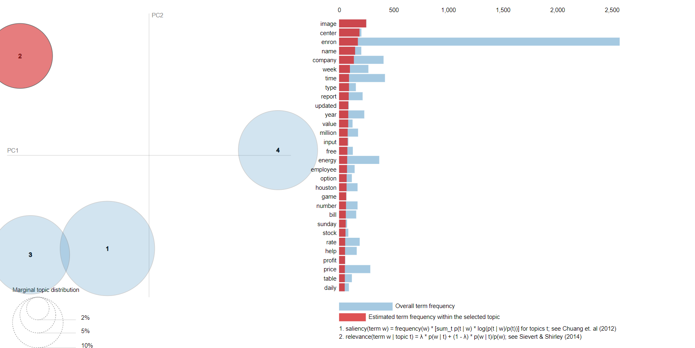

# The Enron Scandal - A Fraud Detection Project Using Text Data

This is the second fraud detection project I am working on, and this time, I will analyze text data in form of emails.

The goals of this project is to create a list of fraudulent terms that helps us to detect fraudulent and non-fraudulent behaviour in the emails. I will use 2 different methods: the manual one and the natural language processing approach.

📈 **Data**: I will use the dataset [The Enron Email Dataset](https://www.kaggle.com/datasets/wcukierski/enron-email-dataset) from Kaggle.
This dataset contains approximately 500,000 emails generated by employees of the Enron Corporation. It was obtained by the Federal Energy Regulatory Commission during its investigation of Enron's collapse. 

🔬 **Methodology**: Python is the primary tool for the data analysis and visualization. Morever, Github shall be used for Project management.

**GitHub**:(https://github.com/msantanarod/The-Enron-Scandal)

Note: On the Notebook, I use LDA_display visualization library. You will be not able to see the visualization unless you run the notebook in your computer. Below, you will find a screenshot of the visualization, so you will be able to follow my analysis. 

